# ModernBERT

This blog presents a comparative analysis of the foundational BERT model and the recent ModernBERT approach.
We first establish the context by reviewing BERT's architecture and limitations.
Subsequently, the analysis details how ModernBERT aims to address these shortcomings through its architectural
modifications and evaluates its performance relative to BERT. The report concludes by discussing the identified
limitations of ModernBERT and proposing viable solutions to overcome these challenges.

<!-- truncate -->

### Introduction

The paper [Smarter, Better, Faster, Longer: A Modern Bidirectional Encoder for Fast, Memory Efficient, and Long
Context Finetuning and Inference](https://arxiv.org/abs/2412.13663), introduces ModernBERT, a new family of encoder-only transformer models
designed to significantly advance the state-of-the-art beyond established models like BERT. While large decoder-
only models (LLMs) like GPT and Llama have gained prominence, encoder models are still crucial for many non-
generative tasks, particularly in IR and classification, due to their efficiency and performance-size tradeoff.
They are foundational components in systems like RAG pipelines, offering semantic search capability to
feed relevant context to LLMs. However, the field has largely continued to rely on older architectures, often BERT
itself, without fully leveraging the advancements made in transformer technology over recent years.
ModernBERT aims to bridge this gap by integrating contemporary optimizations into the encoder framework,
resulting in models that are not only more performant across diverse tasks but also faster, more memory-efficient,
and capable of handling much longer sequences.

### BERT background
Google introduced BERT in 2018, which is significantly advanced NLP. Unlike earlier models that processed text
unidirectionally and sequentially (left-to-right or right-to-left or both), BERT leverages the Transformer architecture
to process the entire sequence of words at once, considering both left and right context simultaneously. This
bidirectionality allows for a deeper understanding of language nuances and context.
Pre-trained on massive text corpora using tasks like Masked Language Modeling, BERT learns powerful
language representations. These pre-trained models can then be quickly fine-tuned with smaller datasets to achieve
SOTA performance on various downstream NLP tasks.

### Problem Statement: Limitations of BERT
Despite their relevance, encoder-only models like BERT face several limitations that hinder their performance
compared to modern advancements. Below are the key issues:
#### Short Sequence Length
BERT is limited to 512 tokens, making it unsuitable for processing long documents, dialogues, or complex contexts
in tasks like long-document retrieval or detailed report analysis. Techniques like pooling can help, but they often
reduce the model's understanding of larger documents.
#### Outdated Architecture
BERT's design, including absolute positional embeddings, post-layer normalization, and GeLU activation, is less
effective than modern alternatives. Its vocabulary size is also not optimized for current hardware, reducing efficiency.
#### Computational Inefficiency
BERT was not designed for modern GPUs or optimized attention mechanisms, leading to slow training and inference.
Padding further wastes computational resources on non-semantic tokens.
#### Limited and Outdated Training Data
BERT's pre-training datasets are smaller and less diverse than modern standards, often lacking code-related data.
This limits its performance on programming tasks and makes its knowledge outdated.
#### Incomplete Modernization Efforts
Recent models like MosaicBERT and CrammingBERT improve training efficiency but don't fully address other
limitations. NomicBERT and GTE-en-MLM support longer contexts (2048 and 8192 tokens respectively), but they
focus on retrieval, reuse older datasets, and lack optimization for inference or classification, especially for code-
related tasks.

### Solution Approach
ModernBERT tackles the limitations of earlier encoders through a multi-pronged approach encompassing
architectural improvements, efficiency optimizations, large-scale training with modern data, and careful model
design:
#### Architectural Improvements:
The core transformer architecture was updated based on inspiration from LLMs. Key changes included:
Rotary Positional Embeddings: ModernBERT replaces absolute positional embeddings with RoPE, providing better
performance in long-context scenarios and easier context extension.
Normalization Strategy: Adopted pre-normalization (applying LayerNorm before the attention/FFN blocks) for
better training stability, similar to models like GPT-2. An additional LayerNorm was added after the embedding layer.
Activation Function: Using GeGLU, a GLU variant that provides empirical improvements over standard GeLU.
Bias Removal: Disabling bias terms in most linear layers (except the final MLM prediction head) and all LayerNorm
layers to allocate parameter budget more effectively to weight matrices. The final decoder bias was retained,
hypothesizing it might help alleviate negative effects of weight tying.
#### Efficiency Enhancements:
Several techniques were incorporated specifically to boost training and inference speed and reduce memory usage:
Alternating Attention: Based on models like Google’s Gemma 2, ModernBERT alternates between global attention
(every token attends to all others) and local sliding window attention (tokens attend only within a 128-token window).
This significantly reduces the quadratic complexity of attention in most layers while retaining global context
processing capability periodically. Different RoPE theta values were used for global (160,000) and local (10,000)
attention layers.
#### Optimized Unpadding:
While unpadding (removing padding tokens and processing concatenated sequences) was
used by MosaicBERT and GTE, ModernBERT employs an improved version. It leverages Flash Attention's variable-
length sequence support to perform unpadding once before the embedding layer and optionally repad only at the
final output, avoiding wasteful internal padding/unpadding steps and yielding 10-20% speed improvements over
prior methods.
Flash Attention: Uses Flash Attention 2 for local attention and Flash Attention 3 for global attention layers to
leverage memory and compute-efficient attention kernels available on modern GPUs.
torch.compile: Leverages PyTorch's built-in compiler to optimize compatible model modules, yielding around a 10%
throughput improvement during training.
#### Training and Data:
Data Scale and Mixture: Trained on a massive 2 trillion tokens, significantly larger than most previous encoders. The
data mixture included diverse sources like web documents, scientific literature, and crucially, code data, reflecting
modern LLM training practices. The final mixture was chosen based on ablation studies.
Modern Tokenizer: A modern BPE tokenizer, adapted from the OLMo project, was used instead of reusing older
BERT/RoBERTa tokenizers. This offers better token efficiency and performance on code. It maintains compatibility
with BERT's special tokens ([CLS], [SEP]) and has a vocabulary size of 50,368 (a multiple of 64 for GPU efficiency),
including unused tokens for downstream flexibility.
#### Sequence Packing:
Used alongside unpadding to pack multiple short sequences into a single longer sequence up
to the maximum length, ensuring batch size uniformity and high packing efficiency (>99%).

#### Training Objective:
Employed the MLM objective with an increased masking rate of 30% (up from BERT's 15%),
found to be more optimal. The NSP objective was removed as it offers no benefit but adds overhead.

#### Optimization:
Used the Stable AdamW optimizer with Adafactor-style update clipping, which provided more stable
training and better downstream results than standard AdamW with gradient clipping. Applied fully decoupled weight
decay, excluding bias and normalization layers.

```mermaid
flowchart TD
    subgraph "ModernBERT Encoder Block"
        input1["Embeddings Layer<br/>(SentencePiece + Segment + Positional[RoPE])"] --> norm01
        norm01["Layer Normalization (w/o bias)<br/>1 time after embedding layer"] --> MBSA
        subgraph MBSA["Self-Attention"]
            norm012["Layer Normalization (w/o bias)"] --> attn1
            attn1["Multi-Head Attention<br/>(Global and Local)"] --> attn_output1
            attn_output1[Attention Output]
        end
        
        attn_output1 --> add11[Add]
        input1 --> add11
        add11 --> norm11["Layer Normalization (w/o bias)"]
        
        subgraph MBFFN["Feed Forward Network"]
            norm11 --> ffn11["Linear Layer (w/o bias)"]
            ffn11 --> gelu1[GeGLU Activation]
            gelu1 --> ffn21["Linear Layer (w/o bias)"]
            ffn21 --> ffn_output1[FFN Output]
        end
        
        ffn_output1 --> add21[Add]
        norm11 --> add21
        add21 --> norm21["Layer Normalization"]
        
        norm21 --> output1[Output Embeddings]
    end
```

```mermaid
flowchart TD
    subgraph "BERT Encoder Block"
        input["Embeddings Layer<br/>(WordPiece + Segment + Positional)"] --> attn
        
        subgraph "Self-Attention"
            attn["Multi-Head Attention (Global)"] --> attn_output
            attn_output[Attention Output]
        end
        
        attn_output --> add1[Add]
        input --> add1
        add1 --> norm1[Layer Normalization]
        
        subgraph "Feed Forward Network"
            norm1 --> ffn1[Linear Layer]
            ffn1 --> gelu[GELU Activation]
            gelu --> ffn2[Linear Layer]
            ffn2 --> ffn_output[FFN Output]
        end
        
        ffn_output --> add2[Add]
        norm1 --> add2
        add2 --> norm2[Layer Normalization]
        
        norm2 --> output[Output Embeddings]
    end
```

